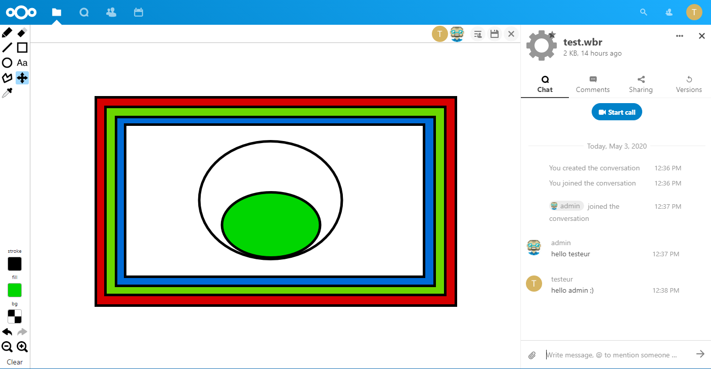

# WhiteBoard

A collaborative whiteboard for nextcloud based on [literally canvas](http://literallycanvas.com/)

 - Online collaborative drawing
 - Only with private share for now
 - you can share directly from the app
 - you can acces to tchat whithin app
 - Limited support for Read Only files

 

 ## Warning

 This app is based on [literally canvas](http://literallycanvas.com/) which means that I'll not be able to change lot's of things in the drawing capabilities ! If you know a better open source whiteboard js library, let me known I'll be happy to switch.